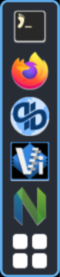
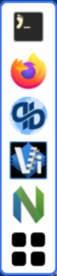

# base16-nwg-dock

<!-- markdownlint-disable MD013 -->

This repo provides templates for using [Base16](https://github.com/tinted-theming/home) color schemes with:
- [nwg-dock](https://github.com/nwg-piotr/nwg-dock);
- [nwg-dock-hyperland](https://github.com/nwg-piotr/nwg-dock-hyprland);
- [nwg-dock-hypreland](https://github.com/jasonherald/mac-doc-hyprland?tab=readme-ov-file#dock-nwg-dock-hyprland), written in Rust;
- [nwg-drawer](https://github.com/jasonherald/mac-doc-hyprland?tab=readme-ov-file#dock-nwg-dock-hyprland),  written in Rust.

a GTK3-based dock for [Sway](https://github.com/swaywm/sway) and [Hyperland](https://hyprland.org/).

All files in `colors` directory generated by [tinted-builder-rust](https://github.com/tinted-theming/tinted-builder-rust?tab=readme-ov-file).

## Examples

### base16-onedark



### base16-google-light



## Usage

For any type of installation, you are expected to use the CSS `@import` directive to import the color scheme that `tinty` generates by default into `~/.local/share/tinted-theming/tinty/` folder.

For example:

```css
/* Color scheme */
@import "/home/blueingreen68/.local/share/tinted-theming/tinty/tinted-nwg-dock-themes-file.css";

window {
  border-width: 3px;
  border-style: solid;
  border-radius: 10px;
}

#box {
  /* Define attributes of the box surrounding icons here */
  padding: 5px;
}

button,
image {
  background: none;
  border-style: none;
  box-shadow: none;
}

button {
  padding: 4px;
  margin: 0 4px;
  font-size: 12px;
}

button:hover {
  border-radius: 2px;
}

button:focus {
  box-shadow: 0 0 2px;
}
```

### Manual

You can find an example config in `examples/style.css`.

Place this file in the directory depending on what you are using:

| App                  | Path                                   |
|----------------------|----------------------------------------|
| `nwg-dock`           | `$XDG_CONFIG_HOME/nwg-dock/`           |
| `nwg-dock-hyperland` | `$XDG_CONFIG_HOME/nwg-dock-hyperland/` |
| `nwg-drawer`         | `$XDG_CONFIG_HOME/nwg-drawer/`         |

### Tinty

1. Add the following to `~/.config/tinted-theming/tinty/config.toml`:

```toml
[[items]]
name = "tintend-nwg-dock"
path = "https://github.com/tinted-theming/tinted-nwg-dock"
themes-dir = "themes"
supported-systems = ["base16"]
```

2. Add `@import` directive to your `~/.config/nwg-dock/style.css` with path to `~/.local/share/tinted-theming/tinty/base16-nwg-dock-colors-file.css`, as in the [usage](#usage) section.

3. `tinty apply base16-google-light` to change the theme to `base16-google-light`.

## License

MIT
